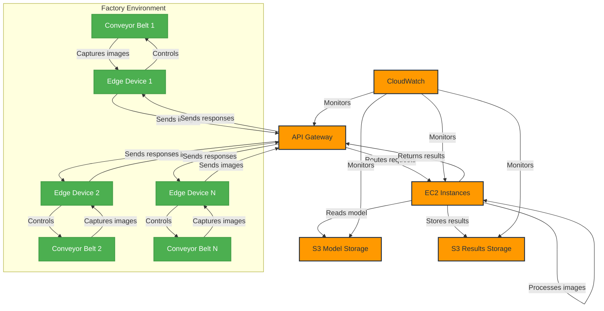

# AWS Design, Planning, and Cost Report - Egg Fertility Detection System

## 1. Architecture Overview

### 1.1 Architecture Diagram

### 1.2 Components

1. **Edge Devices**
   - One per conveyor belt
   - Capture images of eggs on conveyor belts
   - Send images to AWS for processing
   - Receive and act on results

2. **API Gateway**
   - Provides secure API endpoint for all edge devices

3. **EC2 Instances**
   - Run the YOLOv8n model for egg fertility detection
   - Process images from all conveyor belts
   - Number of instances based on total processing needs

4. **S3 Buckets**
   - Model Storage: For storing the YOLOv8n model
   - Results Storage: For temporary storage of processing results and logs

5. **CloudWatch**
   - Monitors system performance and health across all components

### 1.3 Data Flow

1. Edge devices capture images of eggs on their respective conveyor belts
2. Images are sent to API Gateway
3. API Gateway routes requests to EC2 instances
4. EC2 instances process the images:
   - Load model from S3 (if not already in memory)
   - Perform fertility detection
   - Store results temporarily in S3
   - Return results to API Gateway
5. Results are sent back to respective edge devices
6. Edge devices control conveyor belts based on results

## 2. Implementation Plan

[Implementation plan remains largely the same, with emphasis on standardized deployment across all conveyor belts]

## 3. Cost Estimation

### 3.1 Usage-Based Cost Breakdown (For Entire Factory)

#### EC2 Instances (g4dn.xlarge)
- On-Demand: $0.526 per hour per instance
- 1-year Reserved Instance (No Upfront): $0.332 per hour per instance
- 3-year Reserved Instance (All Upfront): $0.196 per hour per instance

#### API Gateway
- Cost per 1 million API calls: $3.50

#### S3
- Storage: $0.023 per GB per month
- PUT/COPY/POST/LIST requests: $0.005 per 1,000 requests
- GET/SELECT requests: $0.0004 per 1,000 requests

### 3.2 Factory Scenario

Let's consider a standardized factory setup:

- Number of conveyor belts: 5
- Operating hours: 16 hours per day, 6 days per week
- Conveyor belt speed: 50,000 eggs per hour
- Weekly production per belt: 16 * 6 * 50,000 = 4,800,000 eggs
- Monthly production per belt (4 weeks): 19,200,000 eggs
- Total monthly production: 5 * 19,200,000 = 96,000,000 eggs

#### Cost Calculation (Total Factory, Per Month)

1. **EC2 Instances** (Assuming 2 instances to handle the load)
   - Hours: 16 * 6 * 4 = 384 hours per month
   - On-Demand Cost: 2 * 384 * $0.526 = $403.96
   - 1-year RI Cost: 2 * 384 * $0.332 = $254.98
   - 3-year RI Cost: 2 * 384 * $0.196 = $150.52

2. **API Gateway**
   - API calls: 96,000,000
   - Cost: 96 * $3.50 = $336.00

3. **S3 Storage** (with automatic deletion after 24 hours)
   - Assuming 5 KB per egg for results and logs
   - Daily storage: (96,000,000 / 30) * 5 KB = 16 GB
   - Storage cost: 16 GB * $0.023 = $0.37

4. **S3 Requests**
   - PUT requests (1 per egg): 96,000 * $0.005 = $0.48
   - GET requests (assuming 10% retrieval): 9,600 * $0.0004 = $0.00384

#### Total Monthly Cost For Factory
- Using On-Demand EC2: $403.96 + $336.00 + $0.37 + $0.48 + $0.00384 ≈ $740.81
- Using 1-year RI EC2: $254.98 + $336.00 + $0.37 + $0.48 + $0.00384 ≈ $591.83
- Using 3-year RI EC2: $150.52 + $336.00 + $0.37 + $0.48 + $0.00384 ≈ $487.37

### 3.3 Additional Considerations

1. **Data Transfer Costs**: This estimation assumes minimal data transfer out of AWS. If significant data needs to be transferred out of AWS, additional costs may apply ($0.09 per GB for the first 10 TB).

2. **CloudWatch Costs**: Basic monitoring is included free. If detailed monitoring is required, additional costs of $2.10 per instance per month would apply.

3. **Model Updates**: Costs for occasional model updates are minimal and not included in this calculation.

4. **Edge Computing**: This estimation assumes all processing occurs in AWS. Implementing edge computing could potentially reduce AWS costs but would increase on-premises infrastructure costs.

### 3.4 Cost Optimization Strategies

1. Use Reserved Instances for EC2 to significantly reduce compute costs.
2. Implement automatic deletion of S3 data after 24 hours to minimize storage costs.
3. Regularly review and optimize EC2 instance types based on actual processing needs.
4. Use AWS Cost Explorer to identify further cost-saving opportunities.
5. Implement a system to periodically extract and store essential metrics before data deletion.

## 4. Scaling Considerations

- EC2: Use appropriately sized instances to handle the fixed load from all conveyor belts
- API Gateway: Configure to handle the known maximum throughput from all edge devices
- S3: Sized to accommodate 24-hour storage needs based on factory production volume
- Edge Devices: Fixed number based on conveyor belts, focus on reliability and maintenance

## 5. Monitoring and Maintenance Plan

1. Set up CloudWatch alarms for:
   - EC2 instance CPU utilization, network I/O, and status checks
   - API Gateway 4xx and 5xx errors
   - S3 bucket size and request count
   - Edge device connectivity

2. Implement logging:
   - EC2 instance logs to CloudWatch Logs
   - S3 access logs (retained for compliance purposes)
   - Edge device logs

3. Regular maintenance tasks:
   - Review and analyze logs daily
   - Update EC2 instance AMIs and patches monthly
   - Conduct system performance review weekly
   - Calibrate edge devices and cameras as needed
   - Extract and store essential metrics before daily data deletion

## 6. Risks and Mitigation Strategies

1. **System Downtime**
   - Risk: AWS service disruptions affecting production
   - Mitigation: Implement local fallback system for critical operations, use multi-AZ deployments

2. **Data Accuracy**
   - Risk: Incorrect fertility detection leading to economic losses
   - Mitigation: Regular model retraining and validation, implement human oversight

3. **Network Connectivity**
   - Risk: Poor connectivity between edge devices and AWS
   - Mitigation: Implement local caching and retry mechanisms, ensure robust factory network

4. **Data Loss**
   - Risk: Important data deleted before analysis
   - Mitigation: Implement robust metric extraction and storage process before daily deletion

5. **Regulatory Compliance**
   - Risk: Failure to meet food industry standards
   - Mitigation: Regular audits, stay updated on regulatory requirements, implement strict data handling and security measures

## 7. Future Enhancements

1. Implement machine learning pipeline for continuous model improvement using extracted metrics
2. Develop a centralized dashboard for monitoring all conveyor belts simultaneously
3. Implement predictive maintenance for both edge devices and conveyor belts
4. Explore potential for local edge computing to reduce latency and AWS dependency
5. Integrate system with broader factory management software for comprehensive oversight
6. Optimize data retention and analysis processes to balance cost-efficiency with valuable insights

