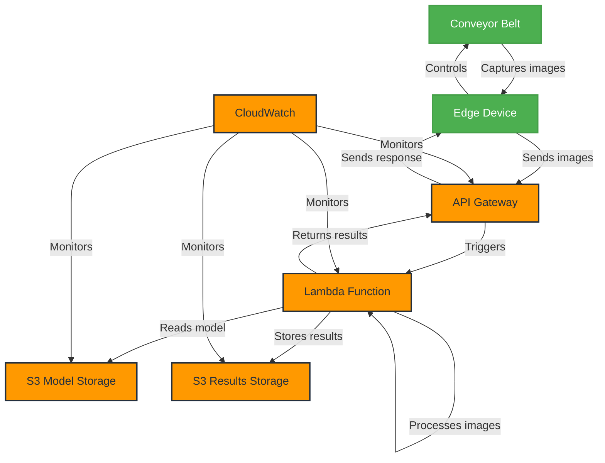

# AWS Design, Planning, and Cost Report - Egg Fertility Detection System

## 1. Architecture Overview

### 1.1 Architecture Diagram

### 1.2 Components

1. **Edge Devices**
   - Capture images of eggs on conveyor belts
   - Send images to AWS for processing
   - Receive and act on results

2. **API Gateway**
   - Provides secure API endpoint for edge devices

3. **Lambda Function**
   - Processes images using YOLOv8n model
   - Determines egg fertility

4. **S3 Buckets**
   - Model Storage: For storing the YOLOv8n model
   - Results Storage: For storing processing results and logs

5. **CloudWatch**
   - Monitors system performance and health

### 1.3 Data Flow

1. Edge device captures image of eggs on conveyor belt
2. Image is sent to API Gateway
3. API Gateway triggers Lambda function
4. Lambda function processes the image:
   - Downloads model from S3 (if not cached)
   - Performs fertility detection
   - Stores results in S3
   - Returns results to API Gateway
5. Results are sent back to edge device
6. Edge device controls conveyor belt based on results

## 2. Implementation Plan

### 2.1 Phase 1: AWS Infrastructure Setup

1. Create S3 buckets for model and results storage
2. Develop Lambda function for egg fertility detection
3. Set up API Gateway and create necessary endpoints
4. Configure CloudWatch monitoring
5. Test basic infrastructure

### 2.2 Phase 2: Edge Device Integration

1. Develop software for edge devices
2. Implement secure communication with API Gateway
3. Test image capture and transmission

### 2.3 Phase 3: Model Deployment and Testing

1. Fine-tune YOLOv8n model for egg fertility detection
2. Upload model to S3
3. Implement model loading and inference in Lambda function
4. Conduct performance testing and optimization

### 2.4 Phase 4: Integration and End-to-End Testing

1. Integrate edge devices with conveyor belt controls
2. Perform end-to-end system testing
3. Optimize for industrial environment (e.g., lighting conditions, conveyor speed)

### 2.5 Phase 5: Security and Compliance

1. Implement encryption for data in transit and at rest
2. Conduct security audit
3. Ensure compliance with food industry standards

### 2.6 Phase 6: Documentation and Deployment

1. Prepare technical documentation
2. Develop deployment and maintenance procedures
3. Train factory personnel on system operation
4. Deploy to production environment

## 3. Cost Estimation

### 3.1 Usage-Based Cost Breakdown (Per Conveyor Belt)

#### Lambda Function
- Cost per 1 million invocations: $0.20
- Compute cost: $0.0000166667 per GB-second
- Assumption: 2048 MB memory, average 100ms execution time
- Cost per 1 million eggs: $0.20 + (2048 * 0.0000166667 * 0.1 * 1,000,000 / 1024) = $3.61

#### API Gateway
- Cost per 1 million API calls: $3.50

#### S3
- Storage: $0.023 per GB per month
- PUT/COPY/POST/LIST requests: $0.005 per 1,000 requests
- GET/SELECT requests: $0.0004 per 1,000 requests

### 3.2 Factory Scenario

Let's consider a typical egg processing factory scenario:

- Operating hours: 16 hours per day, 6 days per week
- Conveyor belt speed: 50,000 eggs per hour
- Weekly production: 16 * 6 * 50,000 = 4,800,000 eggs per week
- Monthly production (4 weeks): 19,200,000 eggs per conveyor belt

#### Cost Calculation (Per Conveyor Belt, Per Month)

1. **Lambda Function**
   - Invocations: 19,200,000
   - Cost: 19.2 * $3.61 = $69.31

2. **API Gateway**
   - API calls: 19,200,000
   - Cost: 19.2 * $3.50 = $67.20

3. **S3 Storage**
   - Assuming 5 KB per egg for results and logs
   - Monthly storage: 19,200,000 * 5 KB = 96 GB
   - Storage cost: 96 GB * $0.023 = $2.21

4. **S3 Requests**
   - PUT requests (1 per egg): 19,200 * $0.005 = $0.10
   - GET requests (assuming 10% retrieval): 1,920 * $0.0004 = $0.0008

#### Total Monthly Cost Per Conveyor Belt
$69.31 + $67.20 + $2.21 + $0.10 + $0.0008 ≈ $138.82

### 3.3 Scaling Considerations

- For a factory with multiple conveyor belts, multiply the per-belt cost by the number of belts.
- Example: A factory with 5 conveyor belts would have an estimated monthly AWS cost of 5 * $138.82 = $694.10

### 3.4 Additional Considerations

1. **Reserved Instance Pricing**: For long-term usage, consider using Reserved Instances for Lambda, which can provide up to 17% savings. This could reduce the Lambda costs from $69.31 to approximately $57.53 per conveyor belt.

2. **Data Transfer Costs**: The estimation assumes minimal data transfer out of AWS. If significant data needs to be transferred out of AWS, additional costs may apply ($0.09 per GB for the first 10 TB).

3. **CloudWatch Costs**: Basic monitoring is included free. If detailed monitoring is required, additional costs of $2.10 per instance per month would apply.

4. **Model Updates**: Costs for occasional model updates and S3 storage for the model itself are minimal and not included in this calculation.

5. **Edge Computing**: This estimation assumes all processing occurs in AWS. Implementing edge computing could potentially reduce AWS costs but would increase on-premises infrastructure costs.

### 3.5 Cost Optimization Strategies

1. Implement auto-scaling to handle varying loads efficiently.
2. Regularly review and optimize S3 storage usage, implementing lifecycle policies for older data.
3. Monitor performance and consider adjusting Lambda memory allocation for optimal cost-performance balance.
4. Use AWS Cost Explorer to identify cost-saving opportunities and set up billing alerts to prevent unexpected charges.

## 4. Scaling Considerations

- Lambda: Auto-scales based on incoming requests
- API Gateway: Can handle high throughput, may need to request limit increases for very high volume
- S3: Virtually unlimited scaling, cost increases with storage and requests
- Edge Devices: Physical scaling required for additional conveyor belts

## 5. Monitoring and Maintenance Plan

1. Set up CloudWatch alarms for:
   - Lambda errors and duration
   - API Gateway 4xx and 5xx errors
   - S3 bucket size and request count
   - Edge device connectivity

2. Implement logging:
   - Lambda function logs to CloudWatch Logs
   - S3 access logs
   - Edge device logs

3. Regular maintenance tasks:
   - Review and analyze logs daily
   - Update dependencies monthly
   - Conduct system performance review weekly
   - Calibrate edge devices and cameras as needed

## 6. Risks and Mitigation Strategies

1. **System Downtime**
   - Risk: AWS service disruptions affecting production
   - Mitigation: Implement local fallback system for critical operations

2. **Data Accuracy**
   - Risk: Incorrect fertility detection leading to economic losses
   - Mitigation: Regular model retraining and validation, implement human oversight

3. **Network Connectivity**
   - Risk: Poor connectivity between edge devices and AWS
   - Mitigation: Implement local caching and retry mechanisms, ensure robust factory network

4. **Cost Overruns**
   - Risk: Unexpected spikes in usage leading to high costs
   - Mitigation: Set up billing alarms, implement usage quotas

5. **Regulatory Compliance**
   - Risk: Failure to meet food industry standards
   - Mitigation: Regular audits, stay updated on regulatory requirements

## 7. Future Enhancements

1. Implement machine learning pipeline for continuous model improvement
2. Explore edge computing solutions for reduced latency
3. Develop dashboard for real-time monitoring of egg fertility rates
4. Integrate system with broader factory management software
5. Implement predictive maintenance for conveyor belts based on image data

